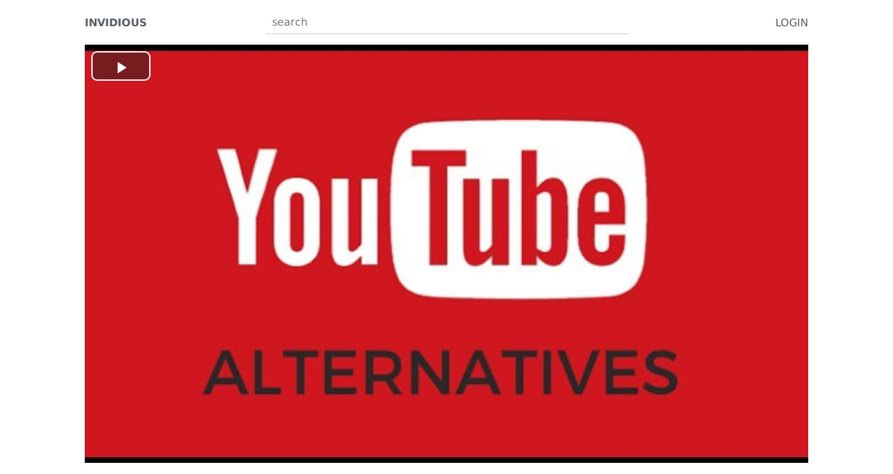
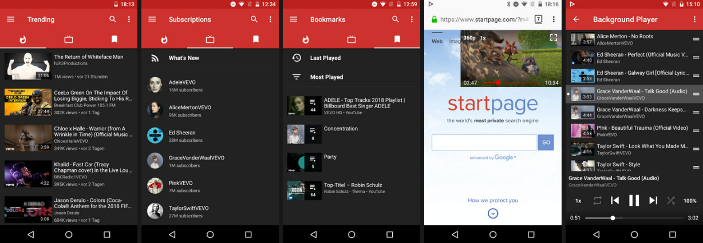
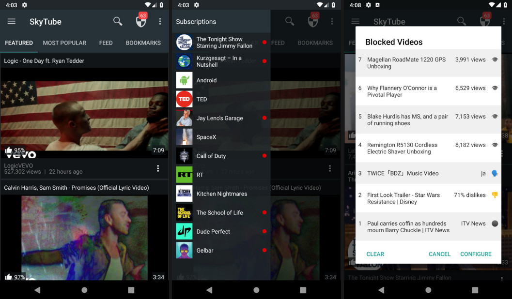

## YouTube (subscriptions) without an account

_First of all: You should not support YouTube_. It's owned by Google and heavily involved in all of their associated activities. But that's another article entirely! Still, there might be content you're interested in that's only available on YouTube. 

Petition the creators to use alternative platforms! If they're non-profit-oriented, it doesn't matter if the platform is changed once in a while. Almost anything else is preferable. Most likely they won't because they're getting very wealthy on YouTube monetisation, which, in turn, **generates enormous income featuring your data**. The following solutions are **fully ad-free**.

To improve privacy for a large number of people, proposed ideas need to be sufficiently **easy and convenient to use**. That's why we'll first talk about a very simple change that everyone can implement.

> "Invidious" (browser-based, desktop, mobile)
  
**Invidious** [1] is an alternative web interface to YouTube. It can be used via the author's website or self-hosted. It minimizes 3rd party connections, works without JavaScript/Cookies, and also supports subscriptions (only if you create an account on their site). It is a lot faster than YouTube, as well.

It also supports YouTube videos embedded in other sites [2], and can redirect links [3] to it via userscripts. You will need a userscript manager like the FOSS "Violentmonkey" [4]. ("Grease-"/"Tampermonkey" are not FOSS)

It does **improve privacy to a certain extent** by stripping away many unnecessary requests; your browser will still send a more or less identifiable header to retrieve the videos. If you have to use YouTube in the browser, this is a helpful tool. It does _not_ use the YouTube API.

**Possible downsides**: If you use the public site it could track your viewing behavior. If you make use of the subscription feature it has to, of course. It does not allow you to delete your account should you ever desire to do so but at least it doesn't require your e-mail or any other data. Sometimes you will encounter errors like 'The media could not be loaded, either because the server or network failed or because the format is not supported'. 

It's best to **avoid relying on redirect scripts** because they may redirect after undesired connections to YouTube have been made already. The same goes for replacing YouTube embeds in websites. A general downside to 3rd-party clients is that you may have to wait out some downtime when YouTube/Google change their systems.

[1] [Invidio](https://invidio.us/) | [GitHub repo](https://github.com/omarroth/invidious) 
[2] [Embedded Videos](https://greasyfork.org/en/scripts/370442-invidious-embed) 
[3] [Userscript](https://greasyfork.org/en/scripts/370461-invidious-redirect) 
[4] [ViolentMonkey Firefox Add-on](https://addons.mozilla.org/en-US/firefox/addon/violentmonkey/) | [GitHub repo](https://github.com/violentmonkey/violentmonkey)

> "NewPipe" (Android)

**NewPipe** [1] is a native Android application with many features that make it a solid choice over any proprietary app. Subscriptions, downloads, background playing (for listening to audio) and even creating playlists are all supported. You **do not need any account**.

It does _not_ use the YouTube API. This solution **improves user privacy immensely** because, just like Invidious, the amount of requests is reduced to the absolute minimum required. It also registers as a handler in Android so **you can open links directly in NewPipe** - no redirects or anything required.

You can also try "SkyTube" [2], which is based on the NewPipe Extractor, for some extra features like comments and filters.

**Possible downsides**: just potential downtime, like explained before.

[1] [NewPipe website](https://newpipe.schabi.org/) / [F-Droid Package](https://f-droid.org/packages/org.schabi.newpipe/) 
[2] [SkyTube website](http://skytube-app.com/) / [F-Droid Package](https://f-droid.org/repository/browse/?fdid=free.rm.skytube.oss)

> "youtube-dl" (any platform with python)

**youtube-dl** [1] is a command line tool to download YouTube videos. This is by far **the most lightweight solution**. No ads, no unnecessary requests, just a quick way to get videos. No extra requests but lots of extra features: you can clearly see which formats are available [2], download specific audio/video formats [3], download audio without re-encoding [4], download whole channels/playlists, filter by various attributes, get and even embed subtitles, use an external download manager, and more. It also supports an extensive list of other videosharing platforms.

To implement this with maximum effect, you could **use an untainted browser** (cookies/localstorage/everything cleared) **via VPN**, collect your YouTube links, then feed them to youtube-dl all at once. You can also paste them into a text file if you have so many they don't fit in the console neatly. [5]

Subscriptions can also be simulated with youtube-dl. We share a script to do so here. This will download a single video, whole channel, or a playlist in a folder called videos and organize it by uploader and more. Windows/Linux/Mac are supported. To use it, you only need to have **youtube-dl (via PyPi), ffmpeg, and aria2** (available in virtually every repository) installed. You could skip aria2 and remove the 2 external-downloader lines, but it's strongly recommended as YouTube is notoriously slow single-threaded. Specifically, it

- downloads the best audio and video up to a maximum height of 720, 480 etc. pixels (adapt this according to your quality preference)
- downloads subtitles in a language of your choice if available (Get them in the currently best format and convert. That is necessary because the style information from YouTube is often corrupt. This way we get clean subs.)
- merges everything in a widely supported MKV container
- keeps track of every video downloaded in a text file

As it only downloads a video once, you can simply watch and delete them afterwards if you like and regularly run the script to fetch new videos. You can automatically do so or just whenever you run out!

Our bash script for Linux/Mac [6] and a Windows batch file [7] are provided.

Installation cannot be covered for every possible system here so if you have questions just ask in our chat. The principle is always as follows:

- download **youtube-dl**, either via PyPi/pip (pip install --upgrade youtube-dl) or homebrew or any other system you might have
- download **ffmpeg** and **aria2**, usually via your package manager, or on Windows in binary form (.exe) [8]
- on Linux you are already set, on other platforms like Windows you need to include the folder with ffmpeg.exe/aria2.exe in your PATH variable

**Possible downsides**: Only potential downtime like explained before.

[1] [youtube-dl website](https://rg3.github.io/youtube-dl/) | [GitHub repo](https://github.com/rg3/youtube-dl/) 
[2] youtube-dl -F https://www.youtube.com/watch?v=VmEY6T5Wc-Q 
[3] Using the previous commands' output we picked an audio+video format we'd like to merge: youtube-dl -f "248+251" https://www.youtube.com/watch?v=VmEY6T5Wc-Q 
[4] youtube-dl -f "bestaudio" https://www.youtube.com/watch?v=uFoN_nrBcx4 (Try it! 😁) 
[5] youtube-dl -a yourList.txt (One video/channel/playlist per line) 
[6] get [this](https://sunbirdgrove.com/~pt/update-yt-subs.html) and make it executable with chmod +x update-yt-subs.sh, then run with ./update-yt-subs.sh 
[7] get [this](https://sunbirdgrove.com/~pt/update-yt-subs-batch.html) and make sure ffmpeg and aria2 are in the PATH variable, then just double click the .bat file 
[8] [aria2](https://github.com/aria2/aria2/releases/) [ffmpeg](https://ffmpeg.zeranoe.com/builds/) Choose the default win32/64 bit builds

> Honorable Mentions

**YtSubsTracker** [1]: Subscription tracker for Linux built with GTK3. Very new, _does not use_ the YouTube API. Might be worth checking out.

**youtube-viewer** [2]: Lightweight Linux desktop application based on GTK2 and perl. No subscription feature but nice for casual browsing. It opens the video in the player of your choice. Keep in mind it _does use_ the YouTube API.

**VLC** [3]: VLC is a popular FOSS media player which **supports streaming** YouTube videos. This is a very simple solution without any special features but it works well for occasional use.

Go to Media-Open Network Stream or just paste the link in the main window. Of course, you need enough bandwidth to do so; by default, it will try to stream the best quality it can. Set a lower resolution in Tools-Preferences, click All at the bottom, Input/Codecs, and finally set the Preferred video resolution. It does not allow anything better than 1080p. Keep in mind that this also _uses_ the YouTube API. To make things easier than navigating through menus, you could try a Firefox addon [4] that lets you open YouTube links in VLC. This requires you to install yet another tool, though, so Firefox can communicate with VLC. [5]

[1] [GitLab repo](https://gitlab.com/Mis012/YtSubsTracker) 
[2] [GitHub repo](https://github.com/trizen/youtube-viewer) 
[3] [VLC website](https://www.videolan.org/vlc/) 
[4] [VLC Firefox Add-on](https://addons.mozilla.org/en-US/firefox/addon/open-in-vlc-videolan/) 
[5] [Native tool needed](https://github.com/alexmarcoo/open-in-native-client/releases)

> YouTube Alternatives

**PeerTube** [1]: A decentralized P2P alternative to YouTube. **Warning**: Due to its P2P nature everyone in the swarm can see your IP. However, it is not censorable. It's **closer to the libre philosophy than anything else** as of today.

**Vimeo** [2]: This might be the **oldest YouTube alternative**. It doesn't have ads in the videos, but uploaders have to pay. (The free service is basically a trial no matter what their marketing department says). It also uses Google Ads, so the privacy benefits are very limited.

There are countless YouTube clones but, so far, none have really established themselves as serious and user-respecting alternatives. If you feel adventurous, you can check out the list of sites youtube-dl supports. [3]

[1] [GitHub repo](https://github.com/Chocobozzz/PeerTube) 
[2] [Vimeo website](https://vimeo.com) 
[3] [List of supported sites](https://github.com/rg3/youtube-dl/tree/master/youtube_dl/extractor)

This post is mirrored from [Privacy Today channel](https://t.me/privacytoday). [Privacy Today](https://t.me/joinchat/Awg5A0UW-tzOLX7zMoTDog) is a group about all things privacy, open source, libre philosophy and more!

All content is licensed under CC BY-NC-SA 4.0. ([Attribution-NonCommercial-ShareAlike 4.0 International](https://creativecommons.org/licenses/by-nc-sa/4.0/)).
