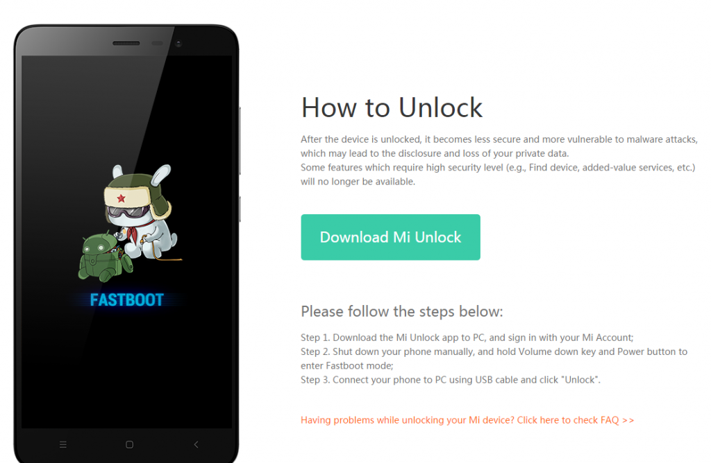
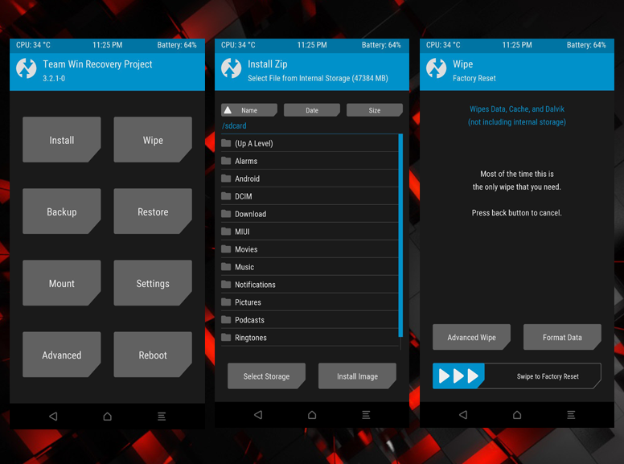
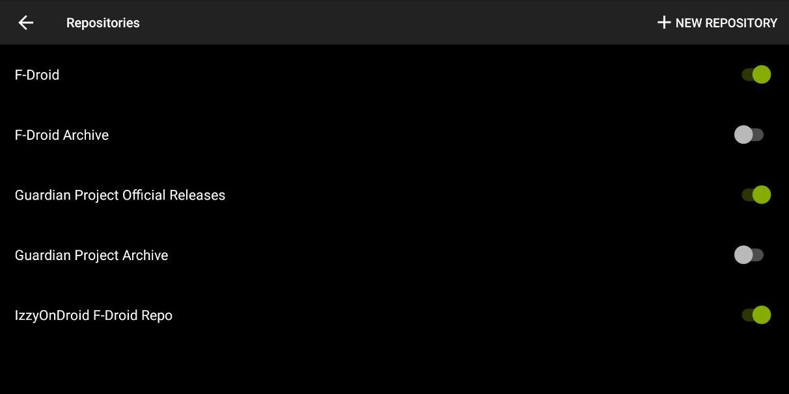

People have been asking me a lot lately about my phone, my Android setup and how I manage to use my smartphone without Google Services. Well, this is a post that aims to address precisely that. I would like to make this article really beginner-friendly so I'll try to go slow, going through things one by one and including screenshots so you can have a better view on how things happen and work like.

At first I'll start with why Google Services are (imo) bad for your device. I could cut it short and guide you to this [post](https://stallman.org/google.html) by [Richard Stallman](https://en.wikipedia.org/wiki/Richard_Stallman), but I'm grabbing a few main points from it and adding them here.

- Nonfree software required
	- In general, most Google services require running nonfree Javascript code. Nowadays, nothing whatsoever appears if Javascript is disabled, even making a Google account requires running nonfree software (Javascript sent by the site), same thing for logging in. 
- Surveillance
	- Google quietly combines its ad-tracking profiles with its browsing profiles and stores a huge amount of data on each user.
- Terms of Service
	- Google cuts off accounts for users that resell Pixel phones. They lose access to all of their mail and documents stored in Google servers under that account.
- Censorship
	- Amazon and Google have cut off domain-fronting, a feature used to enable people in tyrannical countries to reach communication systems that are banned there. 
	- Google has agreed to perform special censorship of Youtube for the government of Pakistan, deleting views that the state opposes. This will help the illiberal Pakistani state suppress dissent.
	- Youtube's "content ID" automatically deletes posted videos in a way copyright law does not require.

These are just a few reasons, but you can read the post by RMS I linked above in which he tries to explain these points in detail. Although it may look like a tinfoil hat reaction to you, all these actions already happen everyday in real life.

### Next on the list, my setup and a tutorial on how I achieved it

I own a **[Xiaomi Redmi Note 5 Pro](https://www.gsmarena.com/xiaomi_redmi_note_5_pro-8893.php)** smartphone (codename **whyred**), produced in China by [Xiaomi](https://en.wikipedia.org/wiki/Xiaomi), which I bought for around 185 EUR 4 months ago (from the time of writing this post).

Now you might be thinking, 'but why did you buy a Chinese brand, they are not reliable'. Yes, it is not made from the usuals as you would expect, such as Samsung (which people often associate with Android, which is plain wrong), OnePlus, Nokia etc, but you should know almost every phone is produced in China.

There were a few reasons I chose this phone, first one of course being the price. It is a quite **budget-friendly** device, so most people are able to afford it. Next one would be the specs, which on paper (not only) are pretty decents for the price tag.
With a 6 inch screen (Full HD resolution), a **4000 mAh battery** (superb battery life), 4GB of RAM, 64GB of storage, dual back cameras (12MP + 5MP), a front camera with flash (13MP) and a decent efficient Snapdragon 636, it was probably the best choice at that moment.

The issue with it was that it came with [MIUI](https://en.wikipedia.org/wiki/MIUI), the Android skin that Xiaomi ships with most of its devices (except the Android One project devices). Yes, it is not that horrible, it has some extra features, but the problems lie deeper within. One of the reasons these devices from Xiaomi are so cheap (afaik they only have 5-10% win margin from sales) is that **they include data mining and ads in the system altogether with MIUI**. In this way, the system apps requires extra unnecessary permissions that mine your data and bombard you with ads, from which Xiaomi earns money. 

Funnily enough, the Weather app included wanted access to my contacts and to make calls, why would it need that if it would just show the weather? Another case was with the Recorder app, it also required contacts and internet permissions, probably to send those recordings back to Xiaomi.

To fix this, I'd have to format the phone and get rid of MIUI. This has become increasingly difficult with the latest phones in the market.

The concept of formatting a phone is simple, you remove the existing system and install a new one of your preference (Android-only in this case). To do that, you have to have your [bootloader](https://forum.xda-developers.com/wiki/Bootloader) unlocked.

> A bootloader is a computer program that loads an operating system (OS) or runtime environment for the computer after completion of the self-tests.
> — [Wikipedia](https://en.wikipedia.org/wiki/Booting)

The problem here is that Xiaomi has a specific policy about the bootloader unlocking. A few months ago, the process was like this.
You would have to [make a request](https://en.miui.com/unlock/) to Xiaomi to obtain an unlock code for your phone, by giving a valid reason, but this would not always work, as they could just refuse your request without reason and explanation.

Now, that process has changed. You'll have to download a specific software from Xiaomi, called [Mi Unlock](http://www.miui.com/unlock/apply.php), install it in your Windows PC, [activate Debugging Settings in Developer Options](https://www.youtube.com/watch?v=7zhEsJlivFA) on your phone, reboot to the bootloader mode (by holding the Volume Down + Power button while the phone is off) and connect the phone to your computer to start a process called "Approval". This process starts a timer on the Xiaomi servers that will allow you to **unlock the phone only after a period of 15 days** (or a month in some rare cases, totally random) goes by.
 

After this period of 15 days has passed, you have to re-connect your phone and do the same procedure as above, then by pressing the Unlock button your bootloader will be unlocked and this will allow you to install other ROM-s (systems). **Careful, make sure to backup your data because unlocking the bootloader deletes everything in the phone**.

The next step would be finding a system ([ROM](https://www.xda-developers.com/what-is-custom-rom-android/)) that works for your device. I searched through the [XDA Developers Forum](https://forum.xda-developers.com/), which is a place where Android developers and users exchange ideas, apps etc. Fortunately, my phone is quite popular so it had [its own forum category](https://forum.xda-developers.com/redmi-note-5-pro). There, I skimmed through some popular ROM-s for my device and decided to use the [AOSiP ROM](https://forum.xda-developers.com/redmi-note-5-pro/development/rom-aosip-8-1-t3804473) (AOSiP standing for Android Open Source illusion Project).

**EDIT**: Someone emailed me to say that my article is exactly what [/e/](https://e.foundation) does and is targeted to. I wanted to say thank you for reaching out but that is _not true_ at all. The reasoning behind my opinion about /e/ can also be found in this [website](https://ewwlo.xyz/evil), but I'll list a few of the reasons here.

eelo is a “foundation” that got over 200K €  in funding from Kickstarter and IndieGoGo, promising to create a mobile OS and web services that are open and secure and protect your privacy.

1. Their OS is based on LineageOS 14.1 (Android 7.1) with microG and other open source apps with it, which already exists for a long time now and it’s called [Lineage for microG](https://lineage.microg.org/).
2. Instead of building all apps from the source code, they download the APKs from [APKPure](https://apkpure.com/) and put them in the ROM, without knowing if those APKs contain proprietary code/malware in them.
3. At one point, they were literally just removing the Lineage copyright header from their code and adding theirs.
4. They love to delete negative feedback and censor their users’ opinions in their Telegram group chat.

In conclusion, I **don't recommend using /e/** ROM-s (at least until now).

Another thing you would likely want to do is have [root access](https://lifehacker.com/5789397/the-always-up-to-date-guide-to-rooting-any-android-phone) to your phone, to make it truly yours and modify files in the system, such as use a system-wide adblocker etc. To do this, I decided to use [Magisk](https://forum.xda-developers.com/apps/magisk/official-magisk-v7-universal-systemless-t3473445), a godsend app developed by a student to help you gain root access on your device and install what are called [modules](https://forum.xda-developers.com/apps/magisk), basically software.

After downloading the ROM and Magisk, I had to install them on my phone. To do that, I moved the files to my SD card on the phone. Now, to install the system, I had to use something called a [recovery system](http://www.smartmobilephonesolutions.com/content/android-system-recovery). The one I use is called [TWRP](https://dl.twrp.me/whyred/) (standing for TeamWin Recovery Project), a popular solution.

To install the recovery system (sounds hard, I know), I had to [flash](https://lifehacker.com/5789397/the-always-up-to-date-guide-to-rooting-any-android-phone) the file on the phone. To do that, I connected my phone with the computer (Fedora Linux system) and with something called [ADB Tools](https://developer.android.com/studio/command-line/adb) I issued a command that overwrites the system recovery with the custom one I had.

> fastboot flash recovery twrp.img

After this was done, I turned off the phone and kept Volume Up + Power button pressed until I saw the TWRP screen show up. That meant I was good to go and it was ready to receive my commands.

Next step was to **issue a Wipe command**, necessary when you first install a custom ROM on your phone. As you can see from the image above, the Wipe command clears the Data, Cache and Dalvik (there is also an advanced option that allows us to tick a box to delete the System one too, as we don't need the old one anymore).

This takes a few moments and after that, your phone is basically clean. Now it's time to **install the system**. By pressing the Install button on the main screen, we select the zip file we added there before (the ROM file) and swipe the screen to install it. Next, we have to install Magisk, which gives us root access to the device.

**EDIT**: As some more experienced/power Android users might have noticed until now, there is no [GApps](https://opengapps.org/) (Google Apps) included. This is what we call GApps-less in the Android world, not having those packages installed at all.

Note that one of the downsides of not having Google Services installed is that some of your apps might not work, for example their notifications might take longer to arrive or might not even work at all (this is what happens with Mattermost app for me). This happens because these apps use [Google Cloud Messaging](https://developers.google.com/cloud-messaging/) (now called [Firebase](https://firebase.google.com/docs/cloud-messaging/)) to wake the phone and push notifications to your phone.

You can solve this (partially) by installing and using [microG](https://microg.org/) which provides some features of Google Services but allows for more control on your side. I don't recommend using this because it still helps Google Services and you don't really give up on them, but it's a good start if you want to quit Google slowly and not go cold turkey on it.

After successfully installing both, now we reboot the phone and **tada** 🎉, we are in the main screen.

### Next part, installing the apps and configuring everything

This is where things start to get easier. To install the apps, I use [F-Droid](https://f-droid.org/), an alternative app store that includes **only free and open source apps**. If you need apps that are not available there, you can use [Aurora Store](https://f-droid.org/en/packages/com.dragons.aurora/), a client to download apps from the Play Store without using your Google account or getting tracked.

F-Droid has what are called repos, a "storehouse" that contains apps you can install. I use the default ones and have added another one from [IzzyOnDroid](https://android.izzysoft.de/repo), that contains some more apps not available from the default F-Droid repo and is updated more often.

Below you will find a list of the apps I have installed, what they replace and their use.

* [AdAway](https://f-droid.org/en/packages/org.adaway) > AdBlocker for the system, blocks ads everywhere using hosts file
* [AfWall+](https://f-droid.org/en/packages/dev.ukanth.ufirewall) > A firewall that allows me to block unwanted connections
* [Amaze](https://f-droid.org/en/packages/com.amaze.filemanager) > Replaces the system file manager, allows for root access to files and also has zip/unzip capabilities
* [Ameixa](https://f-droid.org/en/packages/org.xphnx.ameixa) > Icon pack that has many icons for your apps
* [andOTP](https://f-droid.org/en/packages/org.shadowice.flocke.andotp) > Replaces Google Authenticator/Authy, a TOTP app you can use to login on sites and accounts where you have 2FA enabled, allows backups and locking with PIN
* [AnySoftKeyboard/AOSP Keyboard](https://f-droid.org/packages/com.menny.android.anysoftkeyboard/) > Open Source keyboard, it has many themes and language packs, I am also part of this [project](https://anysoftkeyboard.github.io)
* [Audio Recorder](https://f-droid.org/en/packages/com.github.axet.audiorecorder) > Does what it says, allows you to record audio files in different formats from the microphone
* [Battery Charge Limit](https://f-droid.org/en/packages/com.slash.batterychargelimit) > Automatically stops charging the phone when it reaches 80% to lower battery wear and increase longevity
* [DAVdroid](https://f-droid.org/en/packages/at.bitfire.davdroid) > This is one of my most-used apps, it basically replaces Google Contacts, Google Calendar and Google Tasks for me, it is connected to [my Nextcloud instance](https://cloud.lushka.al) and I have control over my data
* [Document Viewer](https://f-droid.org/en/packages/org.sufficientlysecure.viewer) > A viewer app that can open hundreds of file formats, fast and lightweight
* [Deezloader Remix](https://gitlab.com/Nick80835/DeezLoader-Android/) (an app that allows me to download high quality MP3 files from Deezer)
* [Easy xkcd](https://f-droid.org/en/packages/de.tap.easy_xkcd) > An xkcd comics reader, I love these comics
* [Etar](https://f-droid.org/en/packages/ws.xsoh.etar) > Calendar app, replaces Google Calendar, works with DAVdroid
* [FastHub-Libre](https://f-droid.org/en/packages/com.fastaccess.github.libre) > A GitHub client, entirely FOSS, useful if you use GitHub extensively like I do
* [Fennec F-Droid](https://f-droid.org/en/packages/org.mozilla.fennec_fdroid) > Alternative to Google Chrome and others, a branded Firefox browser for F-Droid, without proprietary blobs/binaries that is updated and allows to install extensions to improve browsing experience
* [K-9 Mail](https://f-droid.org/en/packages/com.fsck.k9) > Email client, replaces GMail app, customizable and can add as many email accounts as you wish
* [Lawnchair](https://f-droid.org/en/packages/ch.deletescape.lawnchair.plah) > Launcher, can replace Nova Launcher or Pixel Launcher, allows customization and various changes, also supports icon packs and more
* [Mattermost](https://f-droid.org/en/packages/com.mattermost.mattermost) > App that allows you to connect to a Mattermost server, Mattermost iu an alternative to Slack
* [NewPipe](https://f-droid.org/en/packages/org.schabi.newpipe) > The best YouTube client IMO, replaces YouTube, it is entirely FOSS, gets rid of YouTube ads, lowers data usage, allows for background play, allows you to download video/audio etc. JUST TRY IT
* [Nextcloud SMS](https://f-droid.org/en/packages/fr.unix_experience.owncloud_sms) > Allows me to backup/sync my SMS to my Nextcloud instance
* [Nextcloud Notes](https://f-droid.org/en/packages/it.niedermann.owncloud.notes) > Allows me to create, edit, delete, share notes and sync/backup to my Nextcloud instance
* [OpenTasks](https://f-droid.org/en/packages/org.dmfs.tasks) > Allows me to create, edit, delete tasks and sync them up with my Nextcloud instance
* [OsmAnd~](https://f-droid.org/en/packages/net.osmand.plus) > A map app, alternative to Google Maps, uses [OpenStreetMap](https://openstreetmap.org), allows for offline download and navigation 
* [QKSMS](https://f-droid.org/en/packages/com.moez.QKSMS) > My favorite SMS app, replaces stock Messaging app, has a beautiful interface, allows backups, customization, has delayed sending feature etc.
* [Resplash/Mysplash](https://f-droid.org/en/packages/com.wangdaye.mysplash) > Allows you to download beautiful and endless wallpapers from [Unsplash](https://unsplash.com), all free to use and modify
* [ScreenCam](https://f-droid.org/en/packages/com.orpheusdroid.screenrecorder) > A screen recorder, allows various customizations and recording modes, no ads and free
* [SecScanQR](https://f-droid.org/en/packages/de.t_dankworth.secscanqr) > A QR scanner app, really fast and lightweight
* [Send Reduced Free](https://f-droid.org/en/packages/mobi.omegacentauri.SendReduced) > This app allows you to share big images instantly by reducing them and remove PII (personally identifiable information) before sending them to someone
* [TrebleShot](https://f-droid.org/en/packages/com.genonbeta.TrebleShot) > This ingenius app allows you to share files over a WiFi connection, in a really fast way, without even having internet access, to other devices
* [Tusky](https://f-droid.org/en/packages/com.keylesspalace.tusky) > Tusky is a client for the [Mastodon](https://joinmastodon.org/) platform that I use to access my [personal Mastodon instance](https://lushka.ml) (Mastodon replaces Twitter)
* [Unit Converter Ultimate](https://f-droid.org/en/packages/com.physphil.android.unitconverterultimate) > This app allows me to convert between 200 units in a snap, it works fully offline and it's fast
* [Vinyl Music Player](https://f-droid.org/en/packages/com.poupa.vinylmusicplayer) > My preferred music player app, replaces Google Play Music or whatever you have already installed on your phone, it has a beautiful interface and many features
* [VPN Hotspot](https://f-droid.org/en/packages/be.mygod.vpnhotspot) > This app allows me to share my VPN while I have enabled my phone to be a hotspot, so I can browse securely even on my laptop without doing anything else
* [Telegram FOSS](https://f-droid.org/en/packages/org.telegram.messenger) > A clean version of Telegram Android client without trackers and Google Services

This is pretty much **my list of the most useful F-Droid apps** I use, but unfortunately these are *NOT* the only apps I use. The proprietary apps I use (I know, I might sound a hypocrite, but not everything is replaceable, not yet at least) are as below:

* AliExpress
* Boost for Reddit
* Google Camera (coupled with Camera API 2, this app allows me to take wonderful pictures with a 185 EUR phone, it's just too impressive)
* Instagram
* MediaBox HD (allows me to stream movies)
* Mi Fit (an app that pairs with my Mi Band 2)
* MyVodafoneAL (the carrier app)
* ProtonMail (email app)
* Shazam Encore (to find those songs you usually listen in coffee shops)
* Snapseed (photo editing app, really simple, powerful and quite good)
* Spotify (music streaming)
* Titanium Backup (to backup my app data, wifi passwords, calls log etc.)
* ViPER4Android FX (music equalizer)
* VSCO (photo editing, never use it really)
* WhatsApp (E2E proprietary messaging app, almost everyone I know has it)
* WiFi Map (mapped hotspots that are available, handy when abroad)

This is pretty much it, all the apps I use on my phone. **The configs are then pretty simple and straightforward and I can give a few tips**.

1. Read and check the permissions of apps carefully, don't click 'Install' mindlessly.
2. Try to use as many open source apps as possible, they both respect your privacy and are free (as in both free beer and freedom).
3. Use a VPN as much as you can, find a reputable one and don't use free ones, otherwise you get to be the product and you'll get your data harvested.
4. Don't keep your WiFi/mobile data/location on all the time, it might be a security risk.
5. Try not to rely on fingerprint unlock only, or better yet use only PIN/password/pattern unlock, as biometric data can be cloned and used against you, for example to unlock your phone and steal your data.

And as a bonus for reading far down here, **a screenshot of my home screen** right now.

All content is licensed under CC BY-NC-SA 4.0. ([Attribution-NonCommercial-ShareAlike 4.0 International](https://creativecommons.org/licenses/by-nc-sa/4.0/)).
